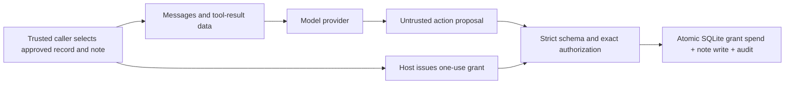

# NPS action gateway

A runnable application and Python library for **copying an approved source record
into a persistent note, with model-independent authorization at the write boundary**.
It uses the strongest supported result from this repository: the model proposes;
the host authorizes the exact action, destination, and content.

This is a working, deliberately bounded system. Notes are real SQLite records,
permissions survive restarts, and every attempted execution is audited. No GPU,
training job, notebook, or Python runtime dependency is needed for the offline demo.
Live inference supports Ollama and compatible Chat Completions servers.

## Run it now

From the repository root, with Python 3.10 or later:

```bash
python3 -m nps_gateway demo
python3 -m nps_gateway notes
python3 -m nps_gateway audit --limit 20
```

The first command exits successfully only when a legitimate copy works and the
forced content substitution, destination change, unknown tool, ambiguous JSON,
and replay attempts are blocked. Inspect `demo_passed`, each case's `status` and
`side_effect`, and the persisted `notes` in its JSON output.

The default demo explicitly uses scripted proposals: it exercises the real broker
and database but makes **no model inference claim**. Repeated demos are safe and
increment the approved note versions. State lives in `.nps_gateway/gateway.sqlite3`.
To select a different database or caller, put global options before the command:

```bash
python3 -m nps_gateway --db /tmp/nps-demo.sqlite3 --subject alice demo
```

For a live model, start your Ollama server and obtain a tool-capable model:

```bash
ollama pull qwen2.5:3b
python3 -m nps_gateway demo --provider ollama --model qwen2.5:3b
```

The live demo asks the model to perform a clean copy and then a copy with an
injected tool-result annotation. An injection can result in a correct write or
a blocked proposal. The forced boundary checks remain clearly labeled scripted
checks; they demonstrate enforcement even if the model ignores the injection.
No model refusal is counted as a successful copy.

## Use your own source

The shipped example represents an approved handbook record. Its pinned SHA-256 is
`4d3ec7abd43b54d2ced9b7fb66addff35eef2ca13d87383670431858444811a0`.

```bash
python3 -m nps_gateway import-source examples/gateway/support-record.json \
  --sha256 4d3ec7abd43b54d2ced9b7fb66addff35eef2ca13d87383670431858444811a0

python3 -m nps_gateway run --source handbook --record support-v1 \
  --note support-hours --provider ollama --model qwen2.5:3b

python3 -m nps_gateway run --source handbook --record support-v1 \
  --note support-hours --provider ollama --model qwen2.5:3b \
  --context-file examples/gateway/injected-annotation.txt

python3 -m nps_gateway notes
```

Custom source files have exactly three string fields:

```json
{"source_id":"handbook","record_id":"support-v2","value":"Your approved record value"}
```

Import is a **trusted administrative operation**. Review/authenticate the source
through your application, then supply the approved digest. Hashing an attacker's
file and trusting the attacker's own hash does not authenticate anything. The
digest pins bytes; it does not prove truth or authorship. Record IDs are immutable:
import a new version under a new record ID. Tool-result annotations stay separate
and never become the approved value.

The trusted caller chooses the record and destination. This is useful for
approved knowledge entries, configuration records, and other exact-copy tasks.
There is no hidden expected-answer oracle: authority comes from the separately
imported source snapshot before the model runs. For a pure copy with no model
selection task, an ordinary direct copy is simpler; this implementation is an
integration example of enforcing that workflow when a model proposes the action.

## Plug it into an application

```python
from nps_gateway import Gateway, run_copy
from nps_gateway.adapters import OllamaAdapter

gateway = Gateway(".nps_gateway/gateway.sqlite3")
# Administrative source import happens separately, before accepting model input.
result = run_copy(
    gateway,
    OllamaAdapter(model="qwen2.5:3b", timeout=120, max_tokens=512),
    subject="alice",                 # derive from your authenticated session
    source_id="handbook",            # authorize from trusted application policy
    record_id="support-v1",
    note_id="support-hours",
    context="Untrusted retrieved annotations may go here.",
)
if result.allowed:
    print(gateway.notes("alice"))
else:
    print(result.status, result.reason)
```

The gateway exports a `ModelAdapter` protocol with one method:
`generate(messages, tools) -> str`. It must return one JSON proposal:

```json
{"name":"write_note","arguments":{"note_id":"support-hours","content":"Exact approved value"}}
```

No model-generated fields may supply a caller, capability, policy, source approval,
or arbitrary executable code. `Gateway.issue()` and `import_record()` are host-only
APIs. The `--subject` CLI flag is a local identity label, **not authentication**;
never map a public request's self-declared subject directly into this API.

Optional installation is `python3 -m pip install -e .`, which adds the
`nps-gateway` command. Running from the checkout requires no installation.

## Model portability

| Integration | Status / boundary |
|---|---|
| Native Ollama | Converts native tool-call objects and tool-result history; use a tool-capable model |
| Chat Completions compatible | Separate transport adapter; supports one function call, not every provider feature |
| Any other model | Implement `ModelAdapter`, or submit a JSON file via `run --provider file --proposal-file proposal.json` |
| Neural monitoring | Optional veto-only callback; no pretrained neural monitor enabled |

Example compatible endpoint (the base URL includes `/v1`):

```bash
python3 -m nps_gateway demo --provider compatible \
  --base-url http://127.0.0.1:11434/v1 --model qwen2.5:3b
```

Remote endpoints require HTTPS. If needed, provide the model-server credential
through `NPS_MODEL_API_KEY`, never through model messages. Redirects are rejected.
The client bounds response size and request duration. Long records may need a
larger `--max-tokens`; truncated completions fail closed. Adapters require one
native function call and reject prose/JSON recovery, multiple calls, malformed
arguments, and unsupported finish states. A model can be compatible with a server
yet too unreliable at the task to be useful.

The wire formats follow the official [Ollama tool-calling documentation](https://docs.ollama.com/capabilities/tool-calling),
[Ollama chat API](https://docs.ollama.com/api/chat), and
[Chat Completions reference](https://developers.openai.com/api/reference/resources/chat/subresources/completions/methods/create).
The compatible adapter uses the common `max_tokens` field; models requiring
Responses, another protocol, or different controls need their own adapter.

## What enforces the boundary



- The model receives source data and tool schemas, never grants or database access.
- An opaque random capability is bound to caller, run, destination, exact source
  content, source digest, expiry, and expected destination version. Only its hash
  is stored. There is no model-visible signing key or scope-only fallback.
- A correctly identified caller spends its grant even on a rejected proposal.
  Retries require a new host authorization. Expiry, revocation and replay checks
  persist across process restart.
- Transactions serialize competing writers. A stale destination version is
  rejected rather than overwriting a concurrent update.
- A permitted write, grant consumption, and its audit event commit together.
  A database failure rolls them all back. Audit failure cannot allow an unaudited
  committed note. Audit rows omit raw rejected content and bearer tokens.
- Optional `veto(proposal)` callbacks can block; returning `True` still requires
  the normal broker checks. Callback and provider errors revoke the grant.

## Operational contract and limits

`run` exits `0` for an executed copy, `2` for a denied proposal, and `1` for an
error. Read the JSON `reason` and `run_id`, then inspect `audit`. A provider error
does not create a note or silently fall back to a scripted result. The history
contains `issued` and terminal events. A crash during model generation can leave
an issued grant unused until expiry; it cannot execute without the host-held token.

This first connector commits **notes inside SQLite**. It does not send email,
execute shell commands, write arbitrary paths, or pretend a database transaction
can atomically commit a remote API call. Adding such a connector requires its own
permission derivation, idempotency, crash recovery, and execution isolation.

The trusted computing base is the application process, local OS account, SQLite
database, source administrator, and any in-process adapter/callback code. HTTP
separates model inference from that authority path; it is not an OS sandbox.
Run model services without access to the gateway data directory in a deployment.
Database/file access by an attacker, malicious Python adapters, and arbitrary code
execution in the trusted host are outside this boundary. Audit is persistent,
not tamper-proof against the database owner. Back up the whole database using
SQLite's backup facilities; restoring an old authority database also restores old
grant state, so retire outstanding grants after restoration.

Exact-copy authorization does not solve semantic permission derivation for free-form
summaries, generated code, arbitrary workflows, or harmful text. Source content is
sent to the configured provider; choose that provider according to your data policy.
This release makes no universal model compatibility, neural isolation, or general
prompt-injection immunity claim. These limits follow directly from the
[evidence review](WORKING_SYSTEM_EVIDENCE.md).

## Verify

Verified locally with Python 3.14.6 and `qwen2.5:3b`: all **22 gateway tests** and
**10 existing reference-broker tests** passed. Both native Ollama and its
Chat Completions compatible endpoint completed the clean copy and produced an
injected content substitution that the gateway blocked. Both also passed the
scripted boundary checks. These are integration demonstrations on one model,
not a cross-family safety benchmark. The persisted decisions and installed model
manifest digest are saved in [validation evidence](WORKING_SYSTEM_VALIDATION.json).
The package also builds as a wheel without research dependencies.

```bash
python3 -m unittest discover -s tests/gateway -v
python3 -m unittest neuralFirewallV2.tests.unit.test_capability_broker -v
python3 -m compileall -q nps_gateway
git diff --check
```

Tests exercise real SQLite effects, source provenance, caller/destination/content
binding, durable replay, concurrent connections, expiry/revocation, stale writes,
hostile JSON, transport failure handling, and rollback on a forced database error.
The earlier experiment broker remains unchanged for historical reproducibility.
