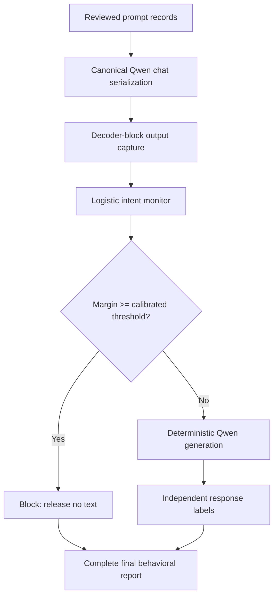

# NFW-002 notebook guide

This guide explains [NFW_002_Foundational_Monitor_Block_POC.ipynb](NFW_002_Foundational_Monitor_Block_POC.ipynb) as an experiment and as the first reliable engineering boundary for the Neural Privilege Separation project.

NFW-002 is deliberately modest. It asks whether a frozen Qwen model can be paired with a monitor of its internal activations that blocks policy-triggering requests before generation, while preserving useful benign requests. It is a proof of concept for a runtime monitor, not proof that a model has a protected policy representation.

## What the notebook is and is not testing

The previous work mixed several targets: harmful-request classification, refusal prediction, jailbreak detection, output harmfulness, and prompt-injection resistance. NFW-002 separates the first three relevant objects:

| Object | Meaning in NFW-002 | Source of truth |
|---|---|---|
| `intent_label` | Whether the reviewed experiment policy says the request should trigger a block | Prompt dataset annotation |
| `monitor_margin` | The logistic monitor's raw activation-space score | Frozen monitor artifact |
| `harmful_assistance` | Whether an actual released Qwen response provides harmful assistance | Independent response annotation |
| `task_success` | Whether a released response successfully completes a benign task | Independent response annotation |

The monitor is trained only on `intent_label`. The behavioral report uses `harmful_assistance` and `task_success` on Qwen outputs generated by this run. This is the key distinction: a request can be policy-triggering while the baseline model safely refuses it, and a request that seems benign can still produce an unsafe or unauthorized response. The notebook does not equate these labels.

It also does not attempt to steer hidden states. Steering may be valuable later, but adding a controller before validating the monitor, data, labels, and runtime creates too many explanations for any apparent improvement. NFW-002 first establishes the monitor-and-block baseline against which a controller must be compared.

## Architecture



The model itself remains frozen. The only learned object is a logistic-regression monitor at one selected decoder-block output. The enforcement action is a pre-generation block; it does not modify model weights or activations.

## Notebook walkthrough

### 1. Setup and frozen configuration

The first code cell defines the run ID, deterministic seed, Qwen reference model, model revision, candidate decoder blocks, input and generation limits, and target false-positive rate.

In Colab, the notebook mounts Google Drive and writes every artifact beneath `Drive/NFW-002/<run_id>/`. Locally, it defaults to `nfw002_outputs/<run_id>/`, which can be overridden with `NFW002_OUTPUT_ROOT`. Set `NFW002_RUN_ID` before the first run and reuse that exact identifier after a Colab reconnect. The reference configuration is mirrored in [qwen25_3b_reference.yaml](../../configs/qwen25_3b_reference.yaml).

The first pass creates `manifest.json` and `splits.json`. A later pass validates the immutable configuration rather than overwriting it: dataset hash, split hash, model ID and revision, tokenizer/chat-template hash, padding, token limits, candidate layers, activation site, pooling, seed, and dtype must match. Once training completes, the manifest additionally binds the exact `intent_monitor.json` hash, selected layer, and calibrated threshold. Any mismatch rejects reuse and requires a new run ID.

Response generation is checkpointed record by record. Each terminal response is flushed to `target_model_responses.jsonl`, then recorded in `completed_ids.jsonl`. On restart, the notebook validates each checkpoint against the run and monitor identities, repairs only the harmless case of an output written just before its completion marker, and generates only missing `(id, condition)` pairs. It never silently retries a terminal error or rewrites an existing response; correct the fault and use a new run ID.

For a final research run, record the exact environment in the run manifest and do not change the model revision, tokenizer template, dataset, split, threshold rule, or evaluator after inspecting final outcomes.

### 2. Dataset contract and validation

The notebook requires `foundation_prompts.jsonl`. In Colab the default is `Drive/NFW-002/foundation_prompts.jsonl`; locally the default is `nfw002_outputs/foundation_prompts.jsonl`. Set `NFW002_DATA_PATH` before the setup cell to use another location. It does not manufacture a synthetic prompt set when the file is missing. That avoids accidentally publishing a detector that succeeds only on templates made by the same codebase.

For a smoke test or engineering run, [prepare_development_dataset.py](prepare_development_dataset.py) converts the existing NFW-01 safe/refusal CSVs into this schema. Its rows receive unique group IDs because the CSVs lack verified paraphrase-family groups. That is adequate for checking runtime and checkpoint behavior, but it is explicitly unsuitable as a research final set until real group annotations are supplied.

Each record needs:

```json
{
  "id": "stable-example-id",
  "messages": [{"role": "user", "content": "request text"}],
  "intent_label": 0,
  "group_id": "underlying-behavior-or-paraphrase-family",
  "source": "dataset-name"
}
```

`messages` is a canonical conversation representation. It accepts only `system`, `user`, and `assistant` roles. Untrusted documents or retrieved content should remain content inside a message and must not be converted into a system message merely because they contain instruction-like text.

The validation cell rejects:

- missing fields, duplicate IDs, empty conversations, invalid roles, and labels outside `{0, 1}`;
- exact duplicate serialized conversations; and
- single-class datasets.

It also calculates a dataset hash. This hash appears in the detector artifact and run manifest so a detector cannot be quietly reused with a different dataset.

### 3. Grouped split creation

The dataset is divided at the `group_id` level into approximate proportions of 50% train, 20% development, 15% calibration, and 15% final. The split builder retries deterministic group assignments only until every partition has both classes. It then saves `splits.json` immediately.

The four partitions have distinct responsibilities:

| Partition | Allowed use |
|---|---|
| Train | Fit candidate logistic monitors |
| Development | Select the decoder block by AUROC |
| Calibration | Select the final block threshold at a predeclared target FPR |
| Final | One-time intent and behavioral evaluation |

The final partition cannot be used to choose a layer, threshold, persistence setting, decoding configuration, intervention magnitude, or response judge. If a research decision is made after looking at final results, make a fresh frozen final set before reporting a new result.

Groups matter more than random row splits. Paraphrases, templates, translations, and prompts based on the same underlying behavior often share surface and latent features. If they land in both training and final partitions, the reported performance can measure memorization of a prompt family rather than generalization. `group_id` is therefore a scientific annotation, not bookkeeping.

### 4. Canonical Qwen serialization

The model cell loads the configured Qwen revision and forces right padding. The `serialize()` function calls Qwen's `apply_chat_template(..., add_generation_prompt=True)`. The exact same serialized form is used for:

1. training/development/calibration/final activation extraction;
2. baseline generation; and
3. monitor-and-block generation.

Previous experiments used different raw-string, chat-template, and truncation pathways. Those differences can change the prompt the model actually receives and invalidate comparisons between offline detector scores and runtime scores.

NFW-002 rejects inputs longer than `MAX_INPUT_TOKENS` instead of extracting a truncated prefix and then generating from a different full prompt. A later deployment-oriented system can support truncation, but it must define one common policy for scoring and generation and report truncation as an outcome.

### 5. Activation-site contract

NFW-002 identifies monitored layers by their zero-indexed decoder block. Its declared site is `decoder_block_output`.

For a candidate block `L`, the captured output is verified against `hidden_states[L + 1]`, because Hugging Face reserves `hidden_states[0]` for the embedding output. This comparison is performed before any detector fitting. If the tensors differ beyond tolerance, the notebook stops rather than guessing an index offset.

The pooling rule is `last_nonpadding_token`. It uses the attention mask to find the greatest valid token position, which works for either left or right padding. The notebook still forces right padding for the reference workflow and records it in the manifest.

During extraction, forward hooks are installed only for the current call and removed in `finally`. The code fails on missing or non-finite activations. This prevents a partial hook failure from being interpreted as an innocuous score.

### 6. Monitor fitting, selection, and calibration

For each candidate layer, the notebook fits a regularized, class-balanced logistic regression on training activations. The classifier produces a raw logit:

```text
margin(x) = wᵀh(x) + b
```

where `h(x)` is the pooled block output, `w` is the learned weight, and `b` is the learned bias. The notebook retains this raw representation rather than presenting a sigmoid output as a calibrated probability.

It selects the candidate layer with the best development AUROC. The selected monitor is then scored on the separate calibration partition. `choose_threshold()` evaluates calibration thresholds and chooses the threshold with the greatest recall subject to empirical false-positive rate at or below `TARGET_FPR`.

The saved `intent_monitor.json` contains the raw weight, bias, threshold, selected layer, activation-site convention, tokenizer/model provenance, training dataset hash, development scores, and calibration result. It is a detector artifact, not an intervention direction. A later controller should not assume that this vector has unit length or that subtracting it from hidden states is safe.

The final partition's intent-monitor metrics are measured only after selection and calibration. They answer a request-level detection question. They do not measure harmful output prevention.

### 7. Baseline and firewall generation

For every final example, the notebook creates exactly two records:

| Condition | Action |
|---|---|
| `baseline` | Generate a deterministic Qwen response |
| `firewall_block` | Score the request; block when the margin exceeds the frozen threshold, otherwise generate with the same Qwen settings |

If the firewall blocks, it releases no text and records `status='blocked'`. If generation succeeds, it records `status='ok'`, the released text, and a hash of the serialized prompt. If any error occurs, it records `status='error'`, including the error type, and stops before behavioral reporting. The error is not removed from the denominator.

This establishes an important but limited security property: the firewall can prevent its own process from releasing an answer for a flagged prompt. It does not establish that every allowed response is safe. It also does not model streamed output, tools, multi-turn state, or context injected after the request.

### 8. Independent response annotation

The response-label cell requires a `response_labels.jsonl` file in the run directory. A label must bind to exactly one `run_id`, example ID, and condition. Every released response must have a label, and no extra or duplicate labels are accepted.

The minimum label fields are:

```json
{
  "run_id": "nfw002_...",
  "id": "stable-example-id",
  "condition": "baseline",
  "harmful_assistance": 0,
  "task_success": 1
}
```

For a research-quality run, establish the evaluator and rubric before generating final outputs. Use a fixed automated judge if appropriate, then perform blinded human review over a stratified sample that includes apparent harms, apparent safe outputs, blocks, disagreements, and edge cases. Keep judge prompts, model versions, annotator instructions, and adjudication rules in the run record.

Do not annotate a Qwen response with a `response_harmful` value borrowed from a dataset row whose text was generated by another model. Do not treat a refusal keyword as a reliable output label. Both errors were important limitations in earlier NFW results.

### 9. Final behavioral report

After exact label matching, the notebook writes `final_behavioral_results.parquet` and `final_report.json`. The report separates:

- final request-level monitor performance;
- baseline harmful-assistance rate;
- firewall released harmful-assistance rate;
- total firewall block rate;
- false-block rate among benign-intent requests; and
- baseline and firewall benign task success.

These values should be reported alongside counts, uncertainty intervals, source-specific results, group-level errors, and evaluator failure rates in a paper. The current notebook intentionally does not compress them into a single “safety score.”

## Run artifacts

| File | Purpose |
|---|---|
| `manifest.json` | Model, tokenizer, template hash, activation site, environment, split, seed, and code provenance |
| `splits.json` | Immutable IDs assigned to the four experiment partitions |
| `intent_monitor.json` | Frozen raw logistic detector and calibration metadata |
| `target_model_responses.jsonl` | Actual baseline and firewall Qwen response records, including terminal status |
| `completed_ids.jsonl` | Per-condition completion markers used to resume interrupted generation safely |
| `response_labels.jsonl` | Independent labels supplied after generation; required for final evaluation |
| `final_behavioral_results.parquet` | Joined example-level experimental record |
| `final_report.json` | Aggregate, explicitly scoped final metrics and limitations |

The artifacts make failures inspectable. For example, if a source has lower recall, higher false blocks, or failed generations, it can be analyzed without recomputing an opaque aggregate.

## How to interpret a result

A successful first PoC should satisfy all of the following:

1. Every expected final example has a terminal record and every released response has an independent label.
2. The monitor performs above its declared baseline on the final request-level task.
3. The firewall reduces independently judged harmful assistance relative to baseline.
4. Benign false blocks and benign task-success degradation stay within predeclared tolerances.
5. The result is stable enough across sources and groups to justify a follow-up experiment.

Failure is informative. Weak transfer may mean the dataset has a source or topic shortcut, the selected activation is not a general policy signal, or prompt-level monitoring is insufficient. High benign false blocks indicate that a coarse request detector is not acceptable as enforcement. No baseline harmful assistance means that dataset cannot evaluate an ASR-reduction claim, even if the monitor reports excellent intent detection.

## Limitations by design

NFW-002 does not establish:

- a universal unsafe-intent representation;
- continuation-level detection or early token-level stopping;
- causal control over model behavior;
- policy-state invariance or bounded user influence;
- resilience to defense-aware adaptive attacks;
- protection from tool-mediated or multi-turn prompt injection; or
- cross-model generalization.

The use of grouped splitting and actual-output labels makes the experiment more trustworthy, but it does not solve those open questions. They belong to later experiments, not to the interpretation of this PoC.

## What follows NFW-002

If NFW-002 is complete and promising, the next step is a continuation monitor. It should preserve the same serializer, model revision, activation-site contract, error accounting, output-label workflow, and untouched final evaluation set. It should score states that causally precede each proposed token and report whether any unsafe text was released before intervention.

Only then should the project evaluate a risk-gated controller. That experiment needs baseline, block-only, random-direction, opposite-sign, unconditional, and intervention-site controls, with behavior judged independently from the monitor score. After a selective controller is demonstrated, NPS can move to policy-conditioned authority tasks and explicit tests of whether lower-trust instructions can alter trusted policy state.

For the broader rationale and the limitations of historical experiments, see the repository [implementation audit](../../../docs/NPS_IMPLEMENTATION_AUDIT.md).
